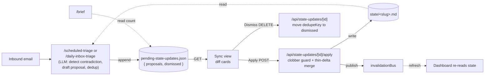

# feat: AIOS State Write-Back via Sync review queue

## Summary

When triage reads an email that contradicts a project's `state/<slug>.md` (launch date moved, status changed, blocker cleared), AIOS drafts the corrected state delta and queues it as a reviewable diff. A new **Sync** view in the operator console lists each proposal as a current-vs-proposed diff that Justin applies, edits, or dismisses. Apply writes the `state/` file with a thin, clobber-guarded delta. This closes the gap where AIOS notices drift but cannot fix it, without silent auto-writes to the dashboard's source of truth.

The build reuses an existing near-exact analog: the `pending-todos` data + API + view trio (atomic write, tagged-result mutate, optimistic-removal review UI). Detection lives in the triage skills (LLM prompt + a JSON store write); the apply/merge/safety logic lives in testable TypeScript in `aios-ui`.

---

## Problem Frame

`state/<slug>.md` files feed the dashboard, the brief, and decisions. Today they change only when Justin or a project `/wrap` edits them:

- `/dispatch` writes state (Step 4) but only for drops in `archives/raw/`.
- `/scheduled-triage` detects launch-date and status changes (Step 8) but routes them only to the project wiki's `raw/aios/` staging, never to `state/`.
- `/brief` is read-only by design.

So a "Wild Rose slips to mid-July" email lands, triage files it to the wiki, and `state/wild-rose.md` stays wrong until a human edits it. This plan gives triage the state-write power dispatch already has, behind a human-reviewed Sync queue.

---

## Requirements

Derived from the approved origin spec (see origin: `docs/superpowers/specs/2026-06-19-aios-state-writeback-design.md`).

- **R1** Triage detects when an email contradicts an existing `state/<slug>.md` field and drafts a proposal (the corrected value), persisted to a store.
- **R2** Proposals never auto-apply; they surface in a dedicated Sync view as current-vs-proposed diffs.
- **R3** Each proposal carries evidence (source, thread, sender, date) and a confidence label (high = explicit attributable fact; low = inference).
- **R4** Apply writes a thin, field-targeted delta to `state/<slug>.md` and bumps `**Updated:**`, mirroring dispatch Step 4 surgery.
- **R5** Apply is clobber-safe: if the state file changed since the proposal was drafted, do not overwrite; mark stale and prompt re-review.
- **R6** Dismiss discards a proposal and records its dedupe key so triage does not re-propose it.
- **R7** Triage does not re-create a proposal whose dedupe key is already pending or dismissed.
- **R8** `/brief` announces the pending-proposal count and points to Sync, but never writes state.
- **R9** Applied lines are attributable to triage (distinct from `/wrap` edits) and reversible via git.
- **R10** Scope is limited to contradictions of existing state fields; wiki dispatch (ADR 0004) is untouched.

---

## Key Technical Decisions

- **Reuse the pending-todos pattern wholesale.** Store + tagged-result mutate (`aios-ui/lib/data/pending-todos.ts`), POST mutate route with `invalidationBus.publish` (`aios-ui/app/api/pending-todos/[id]/route.ts`), and optimistic-removal review view (`aios-ui/components/views/todos-view.tsx`) are the templates. This keeps the feature idiomatic and shrinks the surface.
- **Detection is an LLM step in the triage skills, not TS.** Triage already reads the email and resolves `project_slug` (Step 4). It is best placed to judge a contradiction and draft corrected prose. It writes proposals to the store directly, the same way it writes `triage-latest.json` and `todos/pending.md`. No structured-fact extraction layer (rejected: we have prose, not structured email facts).
- **Apply/merge/clobber-guard are pure TS** in `aios-ui/lib/data/state-merge.ts`, unit-tested. The proposal carries the exact `proposed` value per field; merge only locates the field/section and splices, then bumps `**Updated:**`.
- **Clobber guard via `**Updated:**` comparison.** The proposal records the state file's `**Updated:**` date at draft time (`stateUpdatedAt`). At apply, if the file's current `**Updated:**` differs, the file moved (likely a `/wrap`); refuse and mark stale.
- **Atomic writes** reuse the temp-file + fsync + rename helper from `pending-todos.ts` to avoid torn state files.
- **`**Updated:**` is not a proposable field** — Apply always bumps it as a side effect; proposable fields are `status | current_status | next_step | blocker`.
- **Sync now (manual reconcile) is deferred** to follow-up; it needs a skill-runner trigger and the ambient 2-hour triage already produces proposals.

---

## High-Level Technical Design

Detection writes proposals; the brief only reads the count. Apply is the one path that writes a `state/` file, and it publishes an invalidation so the dashboard refreshes.

---

## Implementation Units

### U1. Proposal store and types

**Goal:** A read/write/dedup store for state-update proposals, modeled on the triage cache.
**Requirements:** R1, R3, R6, R7
**Dependencies:** none
**Files:**
- `aios-ui/lib/types.ts` (add `StateUpdateProposal`, `StateUpdateField`, `StateUpdateStore`)
- `aios-ui/lib/cache/state-updates.ts` (create)
- `aios-ui/tests/lib/cache/state-updates.test.ts` (create)

**Approach:** Mirror `aios-ui/lib/cache/triage.ts`. Store at `aios-ui/.aios-cache/pending-state-updates.json` with shape `{ proposals: StateUpdateProposal[], dismissed: string[] }` (`dismissed` holds dedupe keys). `StateUpdateProposal`: `id`, `slug`, `field` (`status | current_status | next_step | blocker`), `current`, `proposed`, `evidence` (`{ source, threadId, sender, date }`), `confidence` (`high | low`), `stateUpdatedAt`, `dedupeKey`, `createdAt`. Export `readStateUpdates()`, `writeStateUpdates()`, `addProposal()` (skips when `dedupeKey` already in `proposals` or `dismissed`), `removeProposal(id)`, `dismissProposal(id)` (remove from proposals, push `dedupeKey` to `dismissed`). Use the existing `AIOS_CACHE_DIR` env convention from `triage.ts`.

**Patterns to follow:** `aios-ui/lib/cache/triage.ts` (read/write + ENOENT→null), `aios-ui/lib/data/pending-todos.ts` (tagged result types).
**Test scenarios** (`tests/lib/cache/state-updates.test.ts`, mirror `tests/lib/cache/triage.test.ts`):
- Read returns `{proposals:[],dismissed:[]}` when file absent (ENOENT).
- `addProposal` appends a new proposal and round-trips through read.
- `addProposal` is a no-op when `dedupeKey` already exists in `proposals` (dedup).
- `addProposal` is a no-op when `dedupeKey` exists in `dismissed` (no re-propose). Covers R7.
- `dismissProposal` removes from `proposals` and adds `dedupeKey` to `dismissed`. Covers R6.
- `removeProposal` removes the matching id and leaves others intact.

**Verification:** Store helpers round-trip; dedup and dismiss behave per scenarios; `vitest` green.

---

### U2. State-merge and clobber guard

**Goal:** Pure function that applies a proposal to a state-file markdown string, plus the clobber-guard check.
**Requirements:** R4, R5, R9
**Dependencies:** U1 (types)
**Files:**
- `aios-ui/lib/data/state-merge.ts` (create)
- `aios-ui/tests/lib/data/state-merge.test.ts` (create)

**Approach:** Export `applyProposal(markdown, proposal) → { ok: true, markdown } | { ok: false, reason: 'stale' | 'field-not-found' }`. First run the clobber guard: parse the file's `**Updated:**` (reuse the regex/section helpers from `aios-ui/lib/data/state.ts`); if it differs from `proposal.stateUpdatedAt`, return `{ok:false, reason:'stale'}`. Otherwise apply by `field`:
- `status` → replace the `**Status:**` value.
- `current_status` → prepend a dated, attributed line to the `## Current Status` body (e.g. `- 2026-06-19: <proposed> (via triage)`).
- `next_step` → if `current` matches an existing `## Next Steps` bullet, replace it with `proposed`; else append `proposed` as a new bullet.
- `blocker` → add `proposed` as a `## Blockers` bullet, or remove the bullet matching `current` when the proposal clears it.
Always bump `**Updated:**` to today (passed in as a param for testability, not read from the clock). Reuse `sectionBody`-style parsing from `state.ts`; do not reimplement the schema.

**Patterns to follow:** `aios-ui/lib/data/state.ts` (`parseStateFile`, `sectionBody`, the `**Updated:**`/`**Status:**` regexes), `aios-ui/lib/data/pending-todos.ts` (block-splice discipline).
**Test scenarios** (`tests/lib/data/state-merge.test.ts`):
- `status` proposal replaces `**Status:**` and bumps `**Updated:**`. Covers R4.
- `current_status` proposal prepends a dated attributed line under `## Current Status`, preserving existing content.
- `next_step` proposal replaces the bullet matching `current`.
- `next_step` proposal with no matching `current` appends a new bullet.
- `blocker` add appends under `## Blockers`; `blocker` clear removes the matching bullet.
- Clobber guard: proposal `stateUpdatedAt` ≠ file `**Updated:**` returns `{ok:false, reason:'stale'}` and does NOT mutate. Covers R5.
- `field-not-found`: a `status` proposal against a file lacking a `**Status:**` line returns `{ok:false, reason:'field-not-found'}`.
- Applied `current_status` line contains the triage attribution marker. Covers R9.

**Verification:** All field types splice correctly; clobber guard blocks stale applies; no unintended reflow of untouched sections.

---

### U3. State-updates API routes

**Goal:** List, apply, and dismiss endpoints over the store.
**Requirements:** R2, R4, R5, R6
**Dependencies:** U1, U2
**Files:**
- `aios-ui/app/api/state-updates/route.ts` (create — GET list)
- `aios-ui/app/api/state-updates/[id]/apply/route.ts` (create — POST apply)
- `aios-ui/app/api/state-updates/[id]/route.ts` (create — DELETE dismiss)
- `aios-ui/tests/app/api/state-updates.test.ts` (create)

**Approach:** Follow `aios-ui/app/api/pending-todos/[id]/route.ts` exactly: `export const dynamic='force-dynamic'`, `runtime='nodejs'`, `params: Promise<{id}>`. GET returns `readStateUpdates()`. POST apply: load proposal by id (404 if absent), read `state/<slug>.md` via `STATE_DIR` from `state.ts`, call `applyProposal`; on `{ok:false,reason:'stale'}` return 409 with `{error:'stale'}` (the card prompts re-review) and leave the proposal in place; on success `atomicWrite` the state file, `removeProposal(id)`, `invalidationBus.publish({scope:{kind:'admin'}, ...})`, return `{ok:true}`. DELETE dismiss: `dismissProposal(id)` (404 if absent), publish invalidation, return `{ok:true}`. Edit-then-apply is handled client-side (U4 sends an overridden `proposed`); apply accepts an optional body `{ proposed?: string }` that overrides the stored value before merge.

**Patterns to follow:** `aios-ui/app/api/pending-todos/[id]/route.ts` (validation, tagged result → status code, `invalidationBus.publish`), `aios-ui/app/api/triage/latest/route.ts` (GET shape).
**Test scenarios** (`tests/app/api/state-updates.test.ts`, mirror `tests/app/api/pending-todos.test.ts` with a fixture state dir):
- GET returns the current store JSON.
- POST apply on a fresh-matching proposal writes the state file and removes the proposal (assert file contents + store).
- POST apply on a stale proposal returns 409 and leaves both the file and the proposal unchanged. Covers R5.
- POST apply with `{proposed:"edited"}` body applies the edited value, not the stored one.
- POST apply unknown id → 404.
- DELETE dismiss removes the proposal and records its `dedupeKey` in `dismissed`. Covers R6.

**Verification:** Routes return correct status codes; apply mutates the fixture state file; invalidation fires.

---

### U4. Sync view component

**Goal:** The review surface: proposals grouped by project as diff cards with Apply / Edit / Dismiss.
**Requirements:** R2, R3
**Dependencies:** U3
**Files:**
- `aios-ui/components/views/sync-view.tsx` (create)
- `aios-ui/tests/components/sync-view.test.tsx` (create)

**Approach:** Model on `aios-ui/components/views/todos-view.tsx`: fetch `/api/state-updates` (`cache:'no-store'`), group by `slug`, per-row in-flight state, optimistic removal on Apply/Dismiss with revert-on-error. Each card shows `− current` / `+ proposed` (a simple two-line diff, not a char differ), the evidence line (`sender · date · source`), and a confidence label (`brand` badge for high, `muted` "review" for low; low is not visually emphasized). Apply POSTs to `/api/state-updates/[id]/apply`; on 409 stale, surface "state changed since drafted, re-review" on the row instead of removing it. Edit toggles the `proposed` line into a `<textarea>` (reuse the chat-panel auto-grow idiom) and Apply sends `{proposed}`. Dismiss DELETEs. Empty state mirrors `AllClear` in todos-view ("No pending updates. Triage proposes changes here when email contradicts a project's state.").

**Patterns to follow:** `aios-ui/components/views/todos-view.tsx` (optimistic resolve, RowState, grouped sections, empty state), `aios-ui/components/views/dashboard-view.tsx` (card styling, confidence/status badges).
**Test scenarios** (`tests/components/sync-view.test.tsx`, mirror `tests/components/todos-view.test.tsx`):
- Renders a proposal's current/proposed diff, evidence, and confidence label.
- Apply removes the card optimistically and POSTs to the apply route.
- Apply 409 (stale) keeps the card and shows the re-review message. Covers R5 at the UI.
- Edit reveals the textarea; Apply sends the edited `proposed`.
- Dismiss removes the card and DELETEs.
- Empty store renders the empty state.

**Verification:** Renders diffs; actions hit the right endpoints; stale and error paths surface on the row.

---

### U5. Register Sync view and toolbar badge

**Goal:** Add Sync to the three-panel shell with a pending-count badge.
**Requirements:** R2
**Dependencies:** U3, U4
**Files:**
- `aios-ui/components/app-shell.tsx` (add `'sync'` to `ViewId`, `VIEWS`, `VIEW_COMPONENTS`; fetch + hold pending count for the badge)
- `aios-ui/components/toolbar.tsx` (render an optional count badge on a nav item)
- `aios-ui/tests/components/app-shell.test.tsx` (create if absent; otherwise extend) — optional, see test note

**Approach:** Add a `RefreshCw`/`GitCompareArrows` Lucide icon entry `{ id:'sync', label:'Sync', icon }` to `VIEWS` and `SyncView` to `VIEW_COMPONENTS`. App-shell (already `'use client'`) fetches `/api/state-updates` for `proposals.length` and refreshes on the existing invalidation/SSE signal (see `aios-ui/components/sse-listener.tsx` and `aios-ui/lib/invalidation-bus.ts`); pass the count to `Toolbar`, which renders a small badge over the Sync button when `> 0`. Keep toolbar's existing button structure; the badge is an absolutely-positioned span.

**Patterns to follow:** `aios-ui/components/app-shell.tsx` (VIEWS/VIEW_COMPONENTS registration), `aios-ui/components/sse-listener.tsx` (invalidation subscription), badge styling from `components/ui/badge.tsx`.
**Test scenarios:** Light. `Test expectation: minimal` — registration is structural. If an app-shell test exists, assert the Sync nav item renders and selecting it mounts `SyncView`; assert the badge shows the count when `> 0` and hides at `0`. No new behavioral logic beyond the count fetch.

**Verification:** Sync appears in the toolbar with a working badge; selecting it shows the queue; badge updates after Apply/Dismiss via invalidation.

---

### U6. Triage skills: reconcile-state step (the detector)

**Goal:** Triage detects state contradictions and writes proposals.
**Requirements:** R1, R3, R7, R10
**Dependencies:** U1 (store shape is the contract)
**Files:**
- `.claude/skills/scheduled-triage/SKILL.md` (add a "Reconcile state" step after Step 8; update Output contract)
- `.claude/skills/daily-inbox-triage/SKILL.md` (add the same reconciliation on demand)

**Approach:** After the wiki-dispatch step, for each thread that resolved a `project_slug` and carries a state-relevant signal (launch/date change, status change, blocker raised/cleared — the same classification gate as Step 8), read `state/<slug>.md`, compare against the relevant field, and on a genuine contradiction draft a proposal and append it to `aios-ui/.aios-cache/pending-state-updates.json` per U1's shape. Set `confidence:'high'` only when the email states an explicit attributable fact; `'low'` for inference. Compute `dedupeKey = slug:field:hash(proposed)` and skip if already in `proposals` or `dismissed`. Record `stateUpdatedAt` from the file's current `**Updated:**`. Carry over dispatch's "don't invent outcomes" rule: an implied-but-unstated change is at most a low-confidence proposal. Wiki dispatch (Step 8) is unchanged — this only adds the `state/` proposal write (R10).

**Patterns to follow:** `.claude/skills/dispatch/SKILL.md` Step 4 (thin-delta state discipline), `.claude/skills/scheduled-triage/SKILL.md` Steps 7-9 (deterministic file writes, dedup keys, idempotency, "write cache LAST").
**Execution note:** Skill-prompt change, not code. Validate by a dry run against a fixture inbox where one thread contradicts a state file (see Verification).
**Test scenarios:** `Test expectation: none -- skill prompt/doc change.` Manual verification only.
**Verification:** A triage run over a thread that moves a launch date produces exactly one proposal in the store with the right field, confidence, evidence, and dedupeKey; a second run does not duplicate it; an unrelated "thanks" thread produces none.

---

### U7. Brief announces pending proposals

**Goal:** `/brief` surfaces the pending-proposal count and points to Sync, without writing state.
**Requirements:** R8
**Dependencies:** U1
**Files:**
- `.claude/skills/brief/SKILL.md` (add `pending-state-updates.json` to Sources; add a one-line "N state updates proposed → Sync" to the brief output)

**Approach:** Add the store to the brief's read-only Sources list and emit a single line in the output (near the staleness flags) when `proposals.length > 0`, e.g. "3 state updates proposed (review in Sync)." Brief stays strictly read-only — it reports the count, never writes (R8).

**Patterns to follow:** `.claude/skills/brief/SKILL.md` (Sources list, staleness-flag style).
**Test scenarios:** `Test expectation: none -- skill prompt/doc change.`
**Verification:** With proposals present, `/brief` shows the count line and the Sync pointer; with none, the line is absent; no state file is modified by a brief run.

---

### U8. ADR: UI applies AIOS-drafted state diffs

**Goal:** Record the decision that the UI may write `state/` files when applying an approved, AIOS-drafted diff.
**Requirements:** R9, R10
**Dependencies:** none (write alongside U3/U4)
**Files:**
- `docs/adr/0007-ui-applies-aios-drafted-state-diffs.md` (create)

**Approach:** Short ADR in the style of `docs/adr/0004-staged-ingestion-via-raw-aios.md`. Context: the UI was read-only on `state/`; editing happened in the operator's editor. Decision: the UI may apply AIOS-drafted, human-approved state diffs (not freeform editing), via the clobber-guarded apply endpoint, with git as the audit trail. Consequences: dashboard stays current ambiently; reaffirm that ADR 0004 still forbids UI writes into project wiki curated structure (this is the AIOS `state/` layer only).

**Patterns to follow:** existing ADRs `0004`, `0006` (Context / Decision / Consequences shape).
**Test scenarios:** `Test expectation: none -- documentation.`
**Verification:** ADR 0007 exists, references the spec and ADR 0004, and states the clobber-guard + git-audit posture.

---

## Scope Boundaries

**In scope (v1):** contradiction detection of existing `state/` fields in triage; the proposal store; the Sync review view + toolbar badge; clobber-guarded apply/dismiss; brief announcement; ADR.

### Deferred to Follow-Up Work
- **"Sync now" manual reconcile button** — needs a skill-runner trigger; the ambient 2-hour triage already produces proposals.
- **Proposal expiry** — auto-expiring low-confidence proposals untouched for N days.
- **`/weekly-project-status` as a second producer** — it already runs per-project researchers and could feed proposals.

### Out of scope (by design)
- Creating `state/` files for projects that lack one (triage flags it for `/dispatch` or `/kickoff-project`).
- Whole-file rewrites; proposals are field-targeted.
- Any change to wiki dispatch. ADR 0004 stands: triage Step 8 still stages to `{wiki}/raw/aios/` unchanged.

---

## Risks & Dependencies

- **Clobber of a fresh `/wrap`.** Mitigated by the `stateUpdatedAt` guard (U2/U3) returning 409 stale rather than overwriting.
- **Triage re-proposing dismissed changes.** Mitigated by the `dismissed` dedupe set (U1) checked at draft time (U6).
- **Markdown-splice fragility** (state files vary in format). Mitigated by reusing `state.ts` parsing and `field-not-found` fallback rather than blind regex replace; unit tests cover each field.
- **Low-confidence noise.** Mitigated by the confidence label and not pre-emphasizing low-confidence cards; the human is always the gate.
- **Dependency:** U6/U7 depend on the U1 store shape as a contract; land U1 first.

---

## Testing Strategy

Per-unit scenarios above are the spec. Vitest is already configured (`aios-ui/vitest.config.ts`, `tests/`). The load-bearing logic (store dedup/dismiss, merge per field, clobber guard, route status codes, Sync UI optimistic/stale paths) is covered by unit + route + component tests mirroring the `pending-todos` test trio. Skill changes (U6/U7) and the ADR (U8) are doc-level and verified manually per their Verification notes.

---

## Sources & Research

- Origin spec: `docs/superpowers/specs/2026-06-19-aios-state-writeback-design.md` (approved).
- Closest analog (reused pattern): `aios-ui/lib/data/pending-todos.ts`, `aios-ui/app/api/pending-todos/[id]/route.ts`, `aios-ui/components/views/todos-view.tsx`, `aios-ui/tests/lib/data/pending-todos.test.ts`.
- State schema: `aios-ui/lib/data/state.ts`. Cache pattern: `aios-ui/lib/cache/triage.ts`. Invalidation: `aios-ui/lib/invalidation-bus.ts`, `aios-ui/components/sse-listener.tsx`. Shell: `aios-ui/components/app-shell.tsx`, `toolbar.tsx`.
- Triage/dispatch/brief behavior: `.claude/skills/scheduled-triage/SKILL.md`, `.claude/skills/daily-inbox-triage/SKILL.md`, `.claude/skills/dispatch/SKILL.md`, `.claude/skills/brief/SKILL.md`.
- No external research (known stack: Next.js 16 / React 19 / Tailwind 4 / shadcn; strong local pattern). No `docs/solutions/` learnings present.
