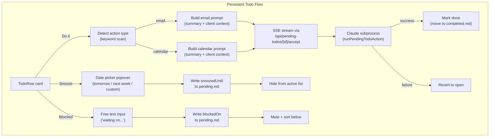

# feat: Add todo card actions — snooze, do-it, blocked

## Summary

Add three actions to persistent todo cards (TodosView): **Do It** (inline task execution via Claude subprocess), **Snooze** (date-based deferral), and **Blocked / Waiting On** (dependency-based deferral with visual muting). Do It is the headline feature — it turns passive reminders into executable actions from the dashboard.

## Problem Frame

Persistent todo cards in the AIOS UI currently support only "Done" and "Dismiss." Action items like "send project proposal by Friday" sit as read-only reminders. Justin reads them, knows what to do, but has to leave the dashboard to act. Cards that are blocked or not-yet-actionable clutter the active list alongside things he can do right now.

Ephemeral todos (from triage) already have an "Accept" button that runs `runTodoAction()` via a Claude subprocess. Persistent todos have no equivalent execution mechanism.

---

## Requirements

**Inline execution**

- R1. Persistent todo cards display a "Do It" button that executes the task inline.
- R2. Action type is detected from the card summary via keyword heuristic: `send`/`email`/`reply` → email; `schedule`/`meeting`/`call` → calendar; else → generic (deferred).
- R3. Email-type "Do It" drafts a Gmail reply/compose using card context + project state via Claude subprocess.
- R4. Calendar-type "Do It" creates a calendar event with attendees and suggested times via Claude subprocess.
- R5. After successful execution, the card auto-transitions to "done."
- R6. Execution streams output via SSE, matching the ephemeral todo accept pattern.

**Snooze**

- R7. Persistent todo cards can be snoozed with a date picker offering "Tomorrow", "Next week", and a custom date input.
- R8. Snoozed cards are hidden from the active list until the snooze date passes.
- R9. A snoozed count badge is visible so sleeping cards aren't forgotten.
- R10. Snooze is reversible from the card itself (un-snooze).

**Blocked / Waiting On**

- R11. Persistent todo cards can be marked blocked with a free-text "waiting on" label.
- R12. Blocked cards remain visible but visually muted and sort below actionable cards.
- R13. Block is reversible from the card (clear block).

---

## Key Technical Decisions

**Snooze and blocked fields stored as metadata lines in `pending.md`.** The persistent todo system parses markdown. Adding `Snoozed until: YYYY-MM-DD` and `Blocked on: <text>` as indented metadata lines (same pattern as `Added:`, `Source:`, `Priority:`) keeps the system consistent. No new storage layer needed.

**Snooze applies to persistent todos only.** Ephemeral todos regenerate daily from triage — a snoozed ephemeral item would reappear on the next run. Adding a snooze overlay to a transient system isn't worth the complexity.

**Do It reuses `runTodoAction()` subprocess pattern.** The ephemeral system spawns a Claude subprocess with a typed prompt and streams output via SSE. Persistent "Do It" follows the same pattern, with prompt builders that use `summary + notes + client slug` instead of the structured `Todo` fields.

**"Accept" stays on ephemeral, "Do It" on persistent.** The labels reflect different semantics: ephemeral todos are triage proposals you accept; persistent todos are tasks you execute. No rename.

**Do It (generic) deferred.** Per the ADR, the open-ended generic case waits until patterns emerge from email and calendar implementations.

---

## High-Level Technical Design

---

## Scope Boundaries

### In scope

- Do It for email and calendar action types on persistent todos
- Snooze with date picker on persistent todos
- Blocked/waiting-on with free text on persistent todos
- Filtering, sorting, and badge counts in TodosView

### Deferred to follow-up work

- Do It (generic) — per ADR, wait for patterns from email/calendar
- Insufficient-context fallback (`/grill-with-docs` session) — defer until Do It is proven
- Auto-unblock via triage email scanning
- Snooze on ephemeral todos
- Mobile swipe gestures (hover-only for now)

---

## Implementation Units

### U1. Data model — extend PendingTodo type and parser

**Goal:** Add `snoozedUntil`, `blockedOn`, and `actionType` to the PendingTodo interface and teach the markdown parser to read/write them.

**Requirements:** R2, R7, R8, R11

**Dependencies:** None

**Files:**
- `aios-ui/lib/types.ts`
- `aios-ui/lib/data/pending-todos.ts`
- `aios-ui/tests/lib/data/pending-todos.test.ts` (new or extend existing)

**Approach:** Add three optional fields to `PendingTodo`. Extend `META_REGEX` matching in the parser to extract `Snoozed until:` and `Blocked on:` lines. Add `actionType` as a computed field derived from keyword scan on `summary` at parse time — not stored in markdown. Add `snoozePendingTodo(id, until)`, `blockPendingTodo(id, text)`, `unsnoozePendingTodo(id)`, `unblockPendingTodo(id)` mutation functions following the existing `resolvePendingTodo` pattern (read → modify → atomic write).

**Patterns to follow:** `resolvePendingTodo()` in `pending-todos.ts` for the read-modify-write pattern. `META_REGEX` for metadata line parsing.

**Test scenarios:**
- Parse a pending.md with `Snoozed until: 2026-07-01` metadata → `snoozedUntil` field is `"2026-07-01"`
- Parse a pending.md with `Blocked on: Cherity to send videos` → `blockedOn` field is `"Cherity to send videos"`
- Parse a todo with no snooze/block metadata → both fields are undefined
- `snoozePendingTodo(id, "2026-07-01")` adds the metadata line to the correct item in pending.md
- `unsnoozePendingTodo(id)` removes the `Snoozed until:` line
- `blockPendingTodo(id, "waiting on videos")` adds the metadata line
- `unblockPendingTodo(id)` removes the `Blocked on:` line
- Keyword detection: summary containing "send email" → `actionType: "email"`
- Keyword detection: summary containing "schedule meeting" → `actionType: "calendar"`
- Keyword detection: summary with no keywords → `actionType: "generic"`

**Verification:** Parser round-trips — snooze/block a todo, re-parse, fields are present. Keyword detection covers the ADR's word list.

---

### U2. API routes — snooze, block, unsnooze, unblock

**Goal:** Expose mutation endpoints for snooze and block actions on persistent todos.

**Requirements:** R7, R10, R11, R13

**Dependencies:** U1

**Files:**
- `aios-ui/app/api/pending-todos/[id]/route.ts`

**Approach:** Extend the existing POST handler to accept new actions: `snooze` (with `until` date param), `unsnooze`, `block` (with `text` param), `unblock`. Add these to the ALLOWED_ACTIONS set and route to the new mutation functions from U1. Publish invalidation after each mutation.

**Patterns to follow:** The existing `done`/`dismiss` action handling in the same file.

**Test scenarios:**
- POST `{action: "snooze", until: "2026-07-01"}` → calls `snoozePendingTodo`, returns updated todo
- POST `{action: "unsnooze"}` → calls `unsnoozePendingTodo`, returns updated todo
- POST `{action: "block", text: "waiting on Cherity"}` → calls `blockPendingTodo`, returns updated todo
- POST `{action: "unblock"}` → calls `unblockPendingTodo`, returns updated todo
- POST with unknown action → 400 error
- POST `{action: "snooze"}` without `until` → 400 error
- POST `{action: "block"}` without `text` → 400 error

**Verification:** Each endpoint mutates pending.md correctly and publishes an invalidation event.

---

### U3. API route — Do It execution (SSE)

**Goal:** Add an SSE accept endpoint for persistent todos that runs inline task execution via Claude subprocess.

**Requirements:** R1, R3, R4, R5, R6

**Dependencies:** U1

**Files:**
- `aios-ui/app/api/pending-todos/[id]/accept/route.ts` (new)
- `aios-ui/lib/skills/pending-todo-actions.ts` (new)

**Approach:** Create a new SSE endpoint mirroring `app/api/todos/[id]/accept/route.ts`. The new `pending-todo-actions.ts` module contains prompt builders for persistent todos: `pendingEmailPrompt(todo)` and `pendingCalendarPrompt(todo)` that use `summary`, `notes`, `client`, and `hashtag` to build context-rich prompts. Route by `actionType` from U1. On success, call `resolvePendingTodo(id, 'done')` to move the item to completed.md. On failure, leave it open. Stream SSE events matching the existing `start`/`chunk`/`done` protocol.

**Patterns to follow:** `app/api/todos/[id]/accept/route.ts` for the SSE stream pattern. `lib/skills/todo-actions.ts` for prompt builder structure and `runTodoAction()` subprocess invocation.

**Test scenarios:**
- POST to accept endpoint with an email-type todo → spawns Claude subprocess with email prompt, streams SSE events
- POST to accept endpoint with a calendar-type todo → spawns Claude subprocess with calendar prompt
- POST to accept endpoint with a generic-type todo → returns 400 (generic deferred)
- Successful execution → todo moved to completed.md
- Failed execution (subprocess error) → todo stays in pending.md, SSE done event carries error
- SSE stream sends `start`, one or more `chunk`, and `done` events

**Verification:** End-to-end: POST to accept → SSE stream completes → todo resolved in pending.md.

---

### U4. TodoRow UI — Do It button and execution panel

**Goal:** Add a "Do It" button to persistent todo cards that triggers inline execution with streaming output.

**Requirements:** R1, R5, R6

**Dependencies:** U2, U3

**Files:**
- `aios-ui/components/views/todos-view.tsx`

**Approach:** Extend `TodoRow` to include a "Do It" button (Play icon, matching ephemeral TodoCard's Accept styling). Only render for todos with `actionType` of `email` or `calendar`. Wire it to POST to the new accept endpoint and consume the SSE stream. Add UI state fields to `RowState`: `acceptOutput`, `acceptError`, `pendingAccept`. Show streamed output in a collapsible monospace box (same pattern as TodoCard). Add an abort ref for cancellation.

**Patterns to follow:** `TodoCard` in `components/todo-list.tsx` lines 242-386 for the accept button, SSE consumption, output display, and abort handling.

**Test scenarios:**
- Todo with `actionType: "email"` → "Do It" button is visible
- Todo with `actionType: "generic"` → "Do It" button is not visible
- Click "Do It" → button shows running state, SSE stream populates output box
- Successful execution → card transitions to done state
- Failed execution → error displayed, card stays open
- Click abort during execution → stream cancelled, card reverts

**Verification:** Click "Do It" on an email-type persistent todo → see streaming output → card auto-resolves to done.

---

### U5. TodoRow UI — snooze button and date picker

**Goal:** Add a snooze action with a date picker popover to persistent todo cards.

**Requirements:** R7, R8, R10

**Dependencies:** U2

**Files:**
- `aios-ui/components/views/todos-view.tsx`
- `aios-ui/components/ui/snooze-picker.tsx` (new)

**Approach:** Create a small `SnoozePicker` popover component with three options: "Tomorrow" (computes tomorrow's date), "Next week" (computes next Monday), and a date input for custom dates. Wire the snooze button (Clock icon) on `TodoRow` to open this popover. On selection, POST to the snooze endpoint from U2. Add "Un-snooze" as a reversible action on snoozed cards.

**Patterns to follow:** Existing button patterns in `TodoRow`. Use native `<input type="date">` for the custom date picker (no library needed).

**Test scenarios:**
- Click snooze → popover opens with three options
- Select "Tomorrow" → POST with tomorrow's ISO date, card disappears from active list
- Select "Next week" → POST with next Monday's ISO date
- Select custom date → date input appears, submit POSTs with selected date
- Snoozed card shows "Un-snooze" action → clicking it calls unsnooze endpoint, card reappears
- Snooze with a past date → validation prevents it (or treat as immediate un-snooze)

**Verification:** Snooze a card → it disappears → un-snooze it → it reappears.

---

### U6. TodoRow UI — blocked button and input

**Goal:** Add a blocked/waiting-on action with a free-text input to persistent todo cards.

**Requirements:** R11, R12, R13

**Dependencies:** U2

**Files:**
- `aios-ui/components/views/todos-view.tsx`

**Approach:** Add a "Blocked" button (PauseCircle icon) that opens a small text input for the "waiting on" label. On submit, POST to the block endpoint from U2. Blocked cards render with reduced opacity and a "Waiting on: {text}" label below the summary. Add "Clear block" as a reversible action. No separate component needed — the input is simple enough to inline.

**Patterns to follow:** Existing action button patterns in `TodoRow`.

**Test scenarios:**
- Click "Blocked" → text input appears with placeholder "Waiting on..."
- Submit with text "Cherity to send videos" → POST to block endpoint, card shows muted with label
- Blocked card displays "Waiting on: Cherity to send videos" below summary
- Click "Clear block" → calls unblock endpoint, card returns to normal styling
- Submit with empty text → validation prevents it

**Verification:** Block a card → it shows muted with the label → clear it → normal styling returns.

---

### U7. TodosView — filtering, sorting, and badge counts

**Goal:** Hide snoozed cards from the active list, sort blocked cards below actionable ones, and show a snoozed count badge.

**Requirements:** R8, R9, R12

**Dependencies:** U4, U5, U6

**Files:**
- `aios-ui/components/views/todos-view.tsx`

**Approach:** Within each priority group, filter out todos where `snoozedUntil` is in the future. Sort remaining todos: actionable first (no `blockedOn`), blocked last. Add a snoozed count to the header (e.g., "17 open · 3 snoozed"). Optionally add a toggle to reveal snoozed cards. The snooze date comparison uses the client's local date.

**Patterns to follow:** The existing priority grouping and count display in `TodosView`.

**Test scenarios:**
- Todo snoozed until tomorrow → hidden from active list
- Todo snoozed until yesterday → visible in active list (snooze expired)
- Snoozed count badge shows correct number
- Within a priority group, blocked cards sort after actionable cards
- Toggle "show snoozed" → snoozed cards appear with a visual indicator
- No snoozed cards → badge not shown

**Verification:** Snooze 2 cards → header shows "2 snoozed" → active list excludes them → they sort correctly when revealed.

---

## Risks & Dependencies

- **Gmail/Calendar MCP availability:** Do It depends on the Gmail and Calendar MCP connectors being available at runtime. The existing ephemeral accept pattern already handles this — if the subprocess fails, the card reverts to open.
- **pending.md format stability:** Adding metadata lines changes the file format. The parser must handle files with and without the new fields (backward compatible by making fields optional).
- **Concurrent writes to pending.md:** Multiple quick actions could race on the file. The existing `atomicWrite` (temp → rename) pattern mitigates this but doesn't fully prevent it. Acceptable for a single-user system.
